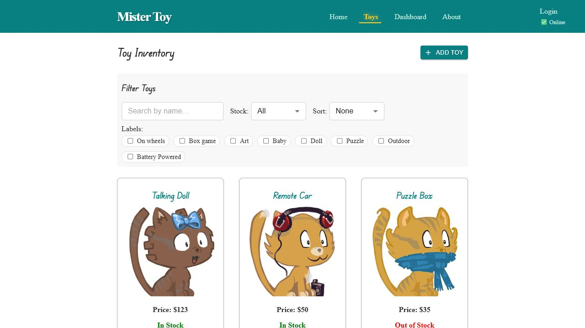

# MisterToy Frontend

## Badges

[](LICENSE)
[](#project-status)
[](https://github.com/aviad-benhamo/ca-mistertoy-frontend/actions/workflows/quality.yml)
[](https://mistertoy-app.onrender.com/)

## Project Status

- State: Approved `v0.1.0` release baseline, pending tag and GitHub Release publication
- Repository type: Coding Academy React and Vite frontend project
- Current package version: `0.1.0`
- Git tag status: No `v0.1.0` tag has been created yet
- GitHub Release status: No GitHub Release has been published yet
- Release policy: Semantic Versioning with `vMAJOR.MINOR.PATCH` Git tags when a release is eventually created

This repository has completed the documentation, repository-baseline, and
release-preparation updates required for the approved `v0.1.0` baseline.
Creating the Git tag and publishing the GitHub Release remain separate manual
steps.

## Overview

MisterToy Frontend is the React and Vite user interface repository for the
MisterToy Coding Academy project. It provides the storefront-style toy
inventory experience, toy details and reviews, charts, authentication screens,
and an About page with a Google Maps integration.

The frontend and backend are maintained in separate repositories:

- Frontend: [aviad-benhamo/ca-mistertoy-frontend](https://github.com/aviad-benhamo/ca-mistertoy-frontend)
- Backend: [aviad-benhamo/ca-mistertoy-backend](https://github.com/aviad-benhamo/ca-mistertoy-backend)

In production, the frontend expects the backend API to be available under the
same origin at `/api/`. For local development, the project can also run in a
frontend-only mode backed by in-memory services.

Related repository documents:

- [SECURITY.md](SECURITY.md)
- [CHANGELOG.md](CHANGELOG.md)
- [ROADMAP.md](ROADMAP.md)
- [LICENSE](LICENSE)

## Features

- Toy inventory browsing with filtering by text, stock state, and labels
- Toy CRUD flows with form validation for add and edit screens
- Toy details view with image fallback handling and review messages
- Login and signup flows backed by the remote API or the local demo service
- Dashboard charts for inventory breakdown and mock sales analytics
- About page map integration driven by `VITE_GOOGLE_MAPS_KEY`
- Local-only mode through `VITE_LOCAL=true` for frontend development without a backend
- Optional build-sync workflow that copies the frontend production build into the sibling backend repository

## Screenshots / Demo

Live demo:

- [mistertoy-app.onrender.com](https://mistertoy-app.onrender.com/)

Representative screenshot:



Screenshot notes:

- The screenshot was captured from local `VITE_LOCAL=true` mode.
- The live demo depends on the deployed backend for full remote functionality.
- GitHub Pages is intentionally not used as the active demo target.

## Quick Start

Prerequisites:

- Node.js `24.6.0` or newer
- npm
- Optional sibling checkout of [aviad-benhamo/ca-mistertoy-backend](https://github.com/aviad-benhamo/ca-mistertoy-backend) when you want remote local development or build-sync output

Recommended runtime:

- [.nvmrc](.nvmrc)

Recommended local repository layout:

```text
<workspace-parent>/
  ca-mistertoy-frontend/
  ca-mistertoy-backend/
```

Install dependencies:

```bash
npm install
```

Start the app against the backend API:

```bash
npm run dev
```

Start the app in local frontend-only mode:

```bash
npm run dev:local
```

Build the production frontend:

```bash
npm run build
```

Preview the production build locally:

```bash
npm run preview
```

Build and sync the frontend into the sibling backend repository:

```bash
npm run build:backend
```

## Configuration

Base configuration files:

- [.env.example](.env.example)
- [vite.config.js](vite.config.js)
- [docs/local-development.md](docs/local-development.md)

Environment variables:

| Variable | Required | Description | Example Placeholder |
|---|---|---|---|
| `VITE_GOOGLE_MAPS_KEY` | Only when using the map integration | Browser-safe Google Maps key for the About page | `YOUR_GOOGLE_MAPS_BROWSER_KEY` |
| `VITE_LOCAL` | No | Switches the app to local in-memory toy and user services when set to `true` | `true` |

Configuration notes:

- Never commit real API keys, tokens, secrets, or `.env` files.
- Keep `VITE_GOOGLE_MAPS_KEY` restricted by HTTP referrer and enable only the required Maps APIs.
- In development remote mode, the frontend expects a backend API at `http://localhost:3030/api/`.
- In production mode, the frontend uses the same-origin API base path `/api/`.

## Design Principles

- Keep the frontend and backend repositories clearly separated but explicitly documented as one working project.
- Preserve the existing application behavior while repository-standard remediation continues.
- Keep committed configuration browser-safe and free of secrets.
- Support both backend-connected development and frontend-only local demo mode.
- Prefer lightweight, repeatable validation through linting, build checks, and CI.
- Keep repository documentation concise, self-contained, and aligned with GRS.

## Project Structure

```text
ca-mistertoy-frontend/
  .github/
    workflows/
  assets/
    screenshots/
  docs/
  public/
  scripts/
  src/
    assets/
    cmps/
    hooks/
    pages/
    services/
    store/
    App.jsx
    main.jsx
  .env.example
  .nvmrc
  CHANGELOG.md
  LICENSE
  README.md
  ROADMAP.md
  SECURITY.md
  index.html
  package.json
  vite.config.js
```

## Architecture

Frontend entry points:

- [src/main.jsx](src/main.jsx) bootstraps React, Redux, routing, and styles
- [src/App.jsx](src/App.jsx) defines the main application shell and route map

Main application areas:

- [src/pages/](src/pages/) route-level screens such as inventory, details, edit, dashboard, login, and about
- [src/cmps/](src/cmps/) reusable UI building blocks including filters, previews, lists, chat, popup, and header
- [src/store/](src/store/) Redux store setup, reducers, and async action flows
- [src/services/](src/services/) local and remote data services, HTTP access, storage helpers, and utility modules
- [src/hooks/](src/hooks/) reusable hooks for online status and unsaved-change protection
- [assets/screenshots/](assets/screenshots/) repository-managed README screenshots

Service modes:

- Remote mode uses API-backed services for toys and users
- Local mode uses in-memory toy and user services when `VITE_LOCAL=true`

Backend relationship:

- The matching backend repository is [aviad-benhamo/ca-mistertoy-backend](https://github.com/aviad-benhamo/ca-mistertoy-backend)
- `npm run build:backend` runs `vite build` and then [scripts/sync-build-to-backend.mjs](scripts/sync-build-to-backend.mjs)
- The sync script copies `dist/` into `../ca-mistertoy-backend/public`

## Development

Available scripts:

```bash
npm run dev
npm run dev:remote
npm run dev:local
npm run build
npm run preview
npm run lint
npm run build:backend
```

Script summary:

- `npm run dev` starts the Vite dev server with remote API-backed services
- `npm run dev:remote` is the same as `npm run dev`
- `npm run dev:local` starts the Vite dev server with in-memory demo services
- `npm run build` creates the production output in `dist/`
- `npm run preview` serves the built app locally
- `npm run lint` runs the current frontend quality baseline
- `npm run build:backend` builds the frontend and syncs the output into the sibling backend repository

Validation workflow:

- Local validation: `npm run lint` and `npm run build`
- CI validation: `npm ci`, `npm run lint`, and `npm run build`
- CI workflow file: [.github/workflows/quality.yml](.github/workflows/quality.yml)

Supporting documentation:

- [docs/local-development.md](docs/local-development.md)
- [docs/demo-deployment.md](docs/demo-deployment.md)
- [docs/media-assets.md](docs/media-assets.md)
- [docs/release-readiness.md](docs/release-readiness.md)

## Roadmap

See [ROADMAP.md](ROADMAP.md) for the remaining follow-through after the
approved `v0.1.0` documentation baseline.

## Changelog

See [CHANGELOG.md](CHANGELOG.md) for the approved `0.1.0` release-ready
history and the current `[Unreleased]` work queue.

## License

This repository is licensed under the [MIT License](LICENSE).
